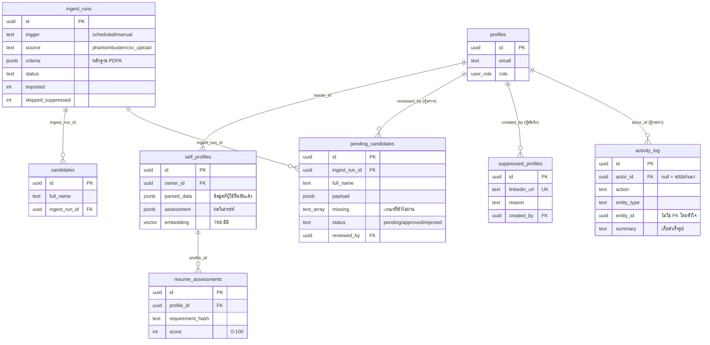
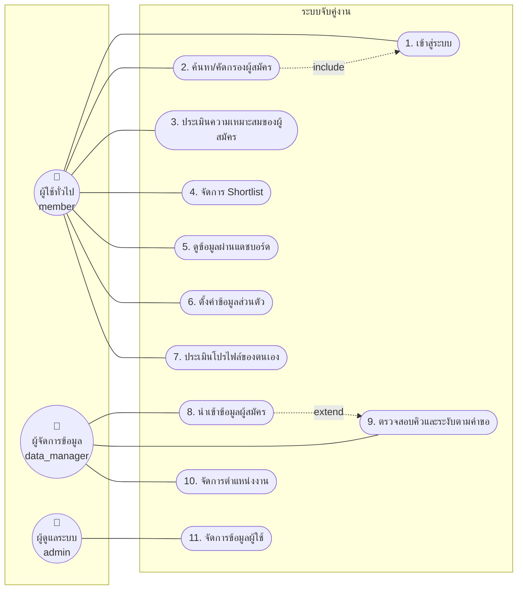
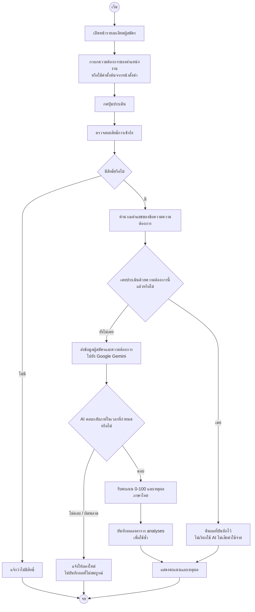
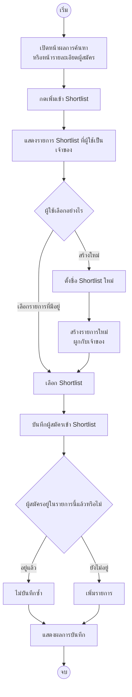
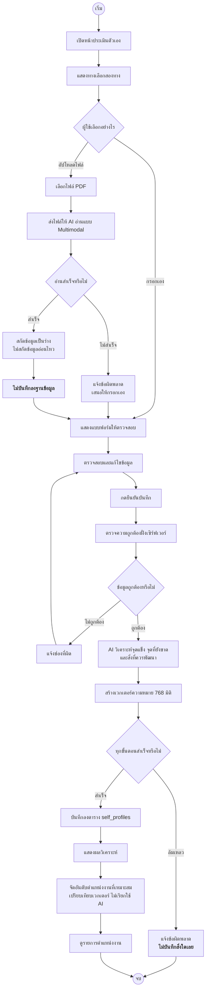
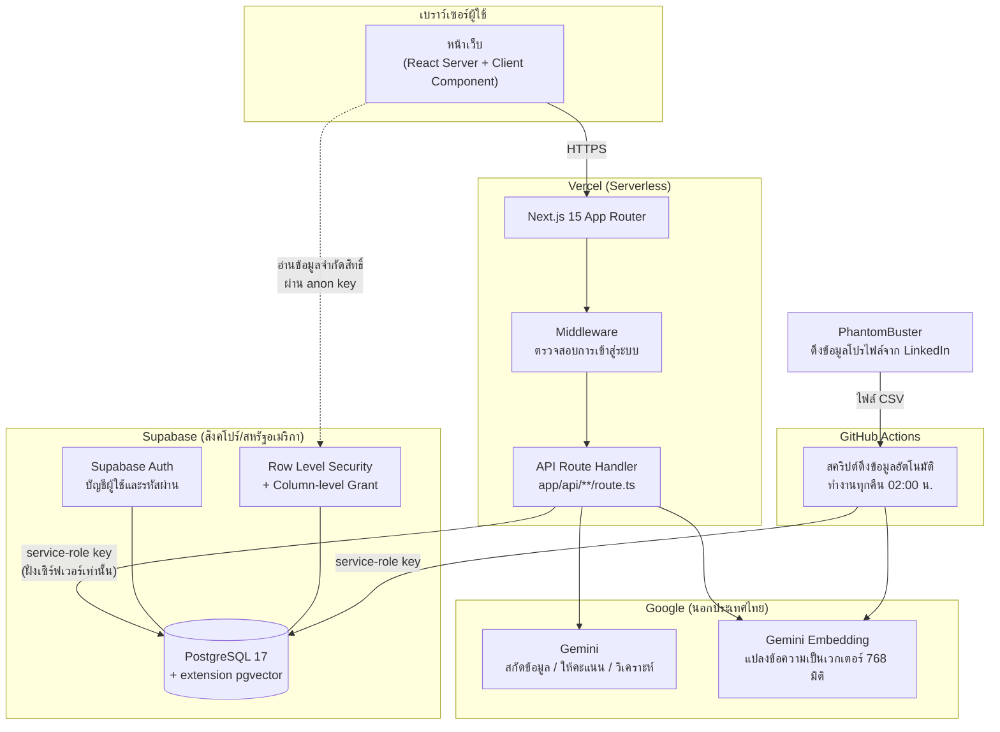

# แนวทางวาดไดอะแกรมใหม่ 4 ชุด

ไฟล์นี้บอกว่า**แต่ละภาพต้องมีอะไรบ้าง** พร้อม source ที่เรนเดอร์เป็นภาพได้จริง
ไม่ใช่คำอธิบายลอยๆ ให้ไปตีความเอง

## วิธีใช้ source ในไฟล์นี้

โค้ดในบล็อก ` ```mermaid ` เอาไปวางที่ **<https://mermaid.live>** แล้วกด Actions →
PNG/SVG ได้ภาพทันที

**สำหรับส่งเล่มจริง แนะนำให้ใช้ผลจาก Mermaid เป็นแบบร่าง แล้ววาดจริงใน draw.io**
ด้วยเหตุผลสองข้อ

1. **สัญลักษณ์ UML** — Mermaid วาด Use Case Diagram ตามมาตรฐาน UML ไม่ได้
   (ไม่มีรูปคนแบบ stick figure ไม่มีวงรี ไม่มีกรอบขอบเขตระบบ) ส่วน Activity Diagram
   ก็ไม่มีสัญลักษณ์ Fork/Join และเส้นแบ่ง Swimlane ที่กรรมการคาดหวัง
2. **ฟอนต์ไทย** — ภาพจาก mermaid.live แสดงไทยได้ แต่ควบคุมฟอนต์ให้ตรงกับเล่มไม่ได้

ที่ Mermaid ช่วยได้จริงคือ **ทำให้เห็นครบว่าต้องมีกล่องอะไรและเส้นไปไหนบ้าง**
ก่อนจะเสียเวลาลากเส้นด้วยมือแล้วพบว่าลืมของ

---

# 1. ER Diagram (หัวข้อ 3.5)

## ปัญหาที่ต้องตัดสินใจก่อนวาด

ของจริงมี **17 ตาราง และ 18 ความสัมพันธ์** ยัดลงหน้า A4 เดียวแล้วอ่านไม่ออกแน่นอน
เล่มเดิมมี 10 ตารางซึ่งพอดีหนึ่งหน้า แต่ไม่ตรงกับของจริง

**ทางที่แนะนำ: แบ่งเป็น 2 ภาพ** ใส่ในเล่มทั้งคู่

- **ภาพที่ 3-11 (ก) ER Diagram ส่วนหลัก** — ผู้ใช้ ผู้สมัคร และการจับคู่งาน
  คือส่วนที่ตอบวัตถุประสงค์ของโครงงานโดยตรง
- **ภาพที่ 3-11 (ข) ER Diagram ส่วนสนับสนุน** — การนำเข้าข้อมูล การประเมินตัวเอง
  และการตามรอย

ทางเลือกอื่นคือวาดรวมภาพเดียวแนวนอนเต็มหน้า ซึ่งอ่านได้แต่ตัวหนังสือจะเล็กมาก

## ความสัมพันธ์ทั้ง 18 เส้น (ดึงจากฐานข้อมูลจริง 2026-09-09)

| ตารางลูก | คอลัมน์ | ตารางแม่ | เมื่อลบแม่ |
|---|---|---|---|
| profiles | id | auth.users | ลบตาม |
| candidates | created_by | profiles | **ห้ามลบแม่** |
| candidates | ingest_run_id | ingest_runs | เป็น null |
| education | candidate_id | candidates | ลบตาม |
| experience | candidate_id | candidates | ลบตาม |
| candidate_skills | candidate_id | candidates | ลบตาม |
| candidate_skills | skill_id | skills | ลบตาม |
| shortlists | owner_id | profiles | ลบตาม |
| shortlist_candidates | shortlist_id | shortlists | ลบตาม |
| shortlist_candidates | candidate_id | candidates | ลบตาม |
| analyses | candidate_id | candidates | ลบตาม |
| analyses | job_id | jobs | ลบตาม |
| self_profiles | owner_id | profiles | ลบตาม |
| resume_assessments | profile_id | self_profiles | ลบตาม |
| ingest_runs ← pending_candidates | ingest_run_id | ingest_runs | เป็น null |
| pending_candidates | reviewed_by | profiles | เป็น null |
| suppressed_profiles | created_by | profiles | เป็น null |
| activity_log | actor_id | profiles | เป็น null |

> **`activity_log.entity_id` ไม่ใช่ Foreign Key อย่าลากเส้นไปหา `candidates`**
> เป็นการออกแบบโดยตั้งใจ (เหตุผลอยู่ในหัวข้อ 3.8.6) ถ้าวาดเส้นไว้ ภาพจะขัดกับ
> ทั้งฐานข้อมูลจริงและคำอธิบายในเล่ม
>
> **`jobs` ไม่มี FK ออกไปหาใครเลย** เป็นตารางที่มาจากสคริปต์คนละยุค มีแต่
> `analyses` ที่ชี้เข้ามา

## Source — ภาพ (ก) ส่วนหลัก

```mermaid
erDiagram
    profiles ||--o{ candidates : "created_by (นำเข้า)"
    profiles ||--o{ shortlists : "owner_id (เป็นเจ้าของ)"
    candidates ||--o{ education : "candidate_id"
    candidates ||--o{ experience : "candidate_id"
    candidates ||--o{ candidate_skills : "candidate_id"
    skills ||--o{ candidate_skills : "skill_id"
    shortlists ||--o{ shortlist_candidates : "shortlist_id"
    candidates ||--o{ shortlist_candidates : "candidate_id"
    candidates ||--o{ analyses : "candidate_id"
    jobs ||--o{ analyses : "job_id (null ได้)"

    profiles {
        uuid id PK
        text email "จาก auth.users"
        text display_name
        user_role role "admin/data_manager/member"
        jsonb settings
    }
    candidates {
        uuid id PK
        text full_name
        text headline
        text industry
        int years_experience
        cand_source source
        vector embedding "768 มิติ"
        text embed_hash
    }
    education {
        uuid id PK
        uuid candidate_id FK
        text institution
        text country
        text degree
        text field_of_study
    }
    experience {
        uuid id PK
        uuid candidate_id FK
        text company
        text title
        date start_date
        date end_date
    }
    skills {
        uuid id PK
        text name UK
    }
    candidate_skills {
        uuid candidate_id PK-FK
        uuid skill_id PK-FK
    }
    shortlists {
        uuid id PK
        text name
        uuid owner_id FK
    }
    shortlist_candidates {
        uuid shortlist_id PK-FK
        uuid candidate_id PK-FK
        text note
    }
    jobs {
        uuid id PK
        varchar title
        text description
        text_array required_skills
        varchar category
        vector embedding "768 มิติ"
    }
    analyses {
        uuid id PK
        uuid candidate_id FK
        uuid job_id FK "null ได้"
        text requirement_hash
        int score "0-100"
        text reasoning
    }
```

## Source — ภาพ (ข) ส่วนสนับสนุน



> **ตาราง `profiles` และ `candidates` โผล่ทั้งสองภาพโดยตั้งใจ** เป็นจุดเชื่อม
> ระหว่างสองส่วน ในภาพ (ข) ใส่เฉพาะคอลัมน์ที่ใช้เชื่อมเท่านั้น ควรวาดด้วยสีจางกว่า
> หรือเส้นประ แล้วเขียนหมายเหตุใต้ภาพว่า "รายละเอียดเต็มดูภาพที่ 3-11 (ก)"

---

# 2. Use Case Diagram (หัวข้อ 3.2)

## สรุปสิ่งที่เปลี่ยน

| เดิมในเล่ม | ทำอย่างไร |
|---|---|
| 1. เข้าสู่ระบบ | คงไว้ |
| 2. จัดการข้อมูลผู้ใช้ | คงไว้ (Admin) |
| 3. ดึงข้อมูล API | คงไว้ แต่เปลี่ยนผู้กระทำเป็น `data_manager` และเพิ่มความสัมพันธ์ `«extend»` ไปยัง "ตรวจสอบคิวข้อมูล" |
| 4. สั่ง AI วิเคราะห์ข้อมูล | **เปลี่ยนชื่อ** → "ประเมินความเหมาะสมของผู้สมัคร" (ข้อ 10 ของรายการแก้เอกสาร) |
| 5. อัปเดตข้อมูลแดชบอร์ด | คงไว้ |
| 6. ตั้งค่าข้อมูลส่วนตัว | คงไว้ (ตอนนี้เปลี่ยนได้ทั้งชื่อและรหัสผ่านจริงแล้ว) |
| 7. ค้นหา/คัดกรอง | คงไว้ |
| 8. บุ๊คมาร์คคนที่สนใจ | **ยุบรวมกับข้อ 9** → "จัดการ Shortlist" (ข้อ 9 ของรายการแก้เอกสาร) |
| 9. สร้าง Grouplist | **ลบ** (รวมเข้าข้อ 8 แล้ว) |
| 10. ดูข้อมูลผ่านแดชบอร์ด | คงไว้ |
| — | **เพิ่ม** "ประเมินโปรไฟล์ของตนเอง" (ข้อ 12) |
| — | **เพิ่ม** "จัดการตำแหน่งงาน" — ดูหมายเหตุข้างล่าง |
| — | **เพิ่ม** "ตรวจสอบคิวข้อมูลและระงับตามคำขอ" — ดูหมายเหตุข้างล่าง |

> ⚠ **สองข้อสุดท้ายยังไม่ได้ตัดสิน** ผมเสนอเพิ่มเพราะทั้งคู่มีอยู่จริงในระบบและ
> ไม่มี Use case รองรับเลย
>
> - **จัดการตำแหน่งงาน** — เล่มมีตาราง `Job_Posting` และ `Matching_Results`
>   ในหัวข้อ 3.6 อยู่แล้ว แต่ไม่มี Use case ว่าใครสร้าง แก้ไข หรือลบตำแหน่งงาน
>   ทั้งที่ระบบทำได้ครบและมีประตูสิทธิ์กั้นไว้ที่ระดับ `data_manager`
> - **ตรวจสอบคิวและระงับตามคำขอ** — เป็นกลไก PDPA ที่หัวข้อ 3.8 (ร่างใหม่)
>   อธิบายไว้ ถ้าไม่มี Use case รองรับ จะมีกลไกที่บทที่ 3 พูดถึงแต่ไม่มีใครสั่งงานมัน
>
> **ถ้าคิดว่าขอบเขตกว้างไปแล้ว ตัดสองข้อนี้ออกได้** แค่ต้องรู้ว่ากำลังตัดอะไรทิ้ง

## Source (ใช้วางแผนเนื้อหา ไม่ใช่ภาพส่งจริง)



> **สิ่งที่ต้องแก้ตอนวาดจริงใน draw.io**
>
> - เปลี่ยนกล่องสี่เหลี่ยมมนเป็น **วงรี** ตามมาตรฐาน UML
> - เปลี่ยนวงกลมเป็น **รูปคน (stick figure)**
> - ใส่ **กรอบสี่เหลี่ยมรอบ Use case ทั้งหมด** พร้อมชื่อระบบที่ขอบบน
>   (System Boundary) — Mermaid วาด `subgraph` ให้แล้วแต่หน้าตาไม่ใช่ UML
> - ลากเส้น **generalization (หัวลูกศรสามเหลี่ยมโปร่ง)** จาก `data_manager`
>   ไปยัง `member` และจาก `admin` ไปยัง `data_manager`
>   **ข้อนี้สำคัญและเล่มเดิมไม่มี** เพราะระบบใช้สิทธิ์แบบลำดับชั้นจริง —
>   `admin` ทำทุกอย่างที่ `member` ทำได้ ถ้าไม่วาด generalization จะต้องลากเส้น
>   จาก actor ทั้งสามไปยัง use case เดียวกันซ้ำสามรอบ ภาพจะรกและสื่อผิดว่า
>   เป็นสิทธิ์คนละชุดที่บังเอิญเหมือนกัน

---

# 3. Activity Diagram

## 3.4.4 — เขียนใหม่ทั้งอัน

**ชื่อเดิม** "การสั่ง AI วิเคราะห์ข้อมูล" → **ชื่อใหม่** "การประเมินความเหมาะสม
ของผู้สมัครกับตำแหน่งงาน"



> **สองจุดที่ควรทำให้เด่นในภาพ** เพราะเป็นการตัดสินใจเชิงออกแบบ
>
> 1. **กิ่ง "เคยประเมินแล้ว → คืนผลเดิม"** คือกลไกแคชที่ทำให้ระบบอยู่ในโควตา
>    ฟรีของ Gemini ได้ ไม่ใช่รายละเอียดการทำงานที่ตัดทิ้งได้
> 2. **"ไม่บันทึกผลที่ไม่สมบูรณ์"** ในกิ่งที่ AI ล้มเหลว

## 3.4.6 — รวม 3.4.6 กับ 3.4.8 เป็นอันเดียว

**ชื่อใหม่** "การจัดการ Shortlist" (ลบ 3.4.8 ทิ้ง เลื่อน 3.4.7 ไปเป็น 3.4.7 เหมือนเดิม)



> **จุดที่การรวมสองไดอะแกรมทำให้เห็นชัดขึ้น** — เดิมเล่มแยก "บุ๊กมาร์ก" กับ
> "สร้าง Grouplist" เป็นสองภาพ ซึ่งบังคับให้ผู้ใช้ตัดสินใจตั้งแต่ต้นว่าจะทำอย่างไหน
> พอรวมแล้วจะเห็นว่ามันคือ flow เดียวที่มีทางแยกตรงกลาง (เลือกรายการเดิม หรือ
> สร้างใหม่) ซึ่งตรงกับที่ระบบทำจริงและง่ายกว่าสำหรับผู้ใช้
>
> **กิ่ง "อยู่แล้ว → ไม่บันทึกซ้ำ"** มาจากคีย์หลักคู่ `(shortlist_id, candidate_id)`
> ในฐานข้อมูล ไม่ใช่ตรรกะที่เขียนเพิ่ม

## 3.4.9 — ใหม่

ผังลำดับอยู่ใน **ส่วน ง** ของไฟล์ `2026-09-09-new-sections-draft.md` แล้ว
ด้านล่างคือ source สำหรับเรนเดอร์



> **ทั้งสามไดอะแกรมข้างบนควรวาดจริงแบบ Swimlane 2 ช่อง** (ผู้ใช้ / ระบบ)
> ให้เหมือนกับ Activity Diagram อื่นในเล่ม กล่องที่ขึ้นต้นด้วย "A" ในโค้ดคือ
> ฝั่งผู้ใช้ ส่วน "B" คือฝั่งระบบ — แบ่งไว้ให้แล้วเพื่อให้ลากเส้นแบ่งช่องได้ง่าย

---

# 4. System Architecture Design (หัวข้อ 3.1)

## สิ่งที่ต้องเอาออกและใส่เข้า

| เอาออก | เพราะ |
|---|---|
| กล่อง **Express.js** | ไม่มีในระบบ API เป็น Route Handler ของ Next.js (ข้อ 1) |
| กล่อง **Docker** | ไม่มีในระบบ deploy บน Vercel (ข้อ 2) |

| ใส่เข้า | เพราะ |
|---|---|
| **Supabase** แทน "PostgreSQL" ลอยๆ | ทำหน้าที่ทั้งฐานข้อมูล ระบบบัญชี และ REST API (ข้อ 3) |
| **pgvector** ในกล่องฐานข้อมูล | เป็นสิ่งที่ทำให้ RAG ในหัวข้อ 2.3.5 ทำงานได้จริง |
| **GitHub Actions** | รอบดึงข้อมูลอัตโนมัติทุกคืน ไม่ได้รันบนเว็บเซิร์ฟเวอร์ |
| **Vercel** | สภาพแวดล้อมที่ระบบทำงานอยู่ |

## Source



> **สามอย่างที่ภาพนี้ต้องสื่อให้ได้ ไม่งั้นวาดใหม่ก็ยังไม่ตรง**
>
> 1. **เบราว์เซอร์ต่อฐานข้อมูลได้ 2 เส้นทาง** — เส้นทึบผ่าน API ของเรา (ใช้กุญแจ
>    service-role ตรวจสิทธิ์เอง) และเส้นประตรงไปยังฐานข้อมูลด้วยกุญแจสาธารณะ
>    ซึ่งถูกกั้นด้วย RLS + Column Grant **เส้นประนี้คือเหตุผลทั้งหมดที่ต้องมี
>    การควบคุมสิทธิ์ที่ฐานข้อมูล** ถ้าวาดแค่เส้นเดียวผ่าน API หัวข้อ 3.8.1
>    จะอ่านแล้วไม่เข้าใจว่ากันอะไรอยู่
> 2. **สคริปต์ดึงข้อมูลไม่ได้รันบนเว็บเซิร์ฟเวอร์** อยู่คนละกล่องกับ Vercel
>    เพราะงานนำเข้าข้อมูลหลายร้อยรายการใช้เวลาเกินเพดานของ Serverless Function
> 3. **กล่อง Google และ Supabase อยู่นอกประเทศไทย** ควรเขียนที่ตั้งกำกับไว้ในภาพ
>    เพราะเป็นสิ่งที่หัวข้อ 3.8.4 อ้างถึงเรื่องการโอนข้อมูลข้ามพรมแดน

---

# ลำดับที่แนะนำ

1. **System Architecture (3.1)** ก่อน — ง่ายที่สุดและเป็นภาพที่คนอ่านเจอก่อนเพื่อน
2. **ER Diagram (3.5)** — ใช้เวลานานที่สุด ทำตอนยังมีแรง
3. **Use Case Diagram (3.2)** — ต้องตัดสินเรื่อง 2 use case ที่ค้างอยู่ก่อน
4. **Activity Diagram** ทั้งสามอัน — ทำท้ายสุดเพราะอ้างอิงจากสามอันข้างบน
